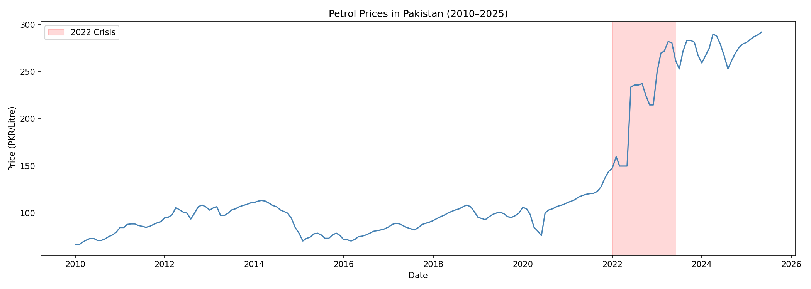
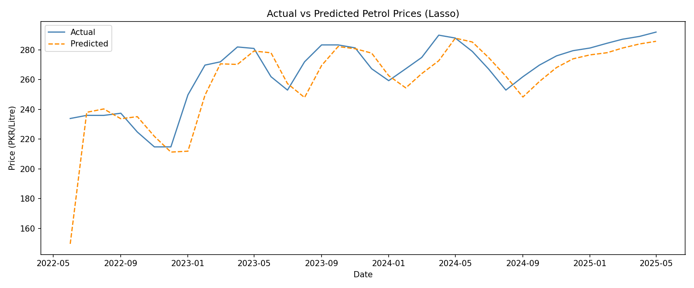
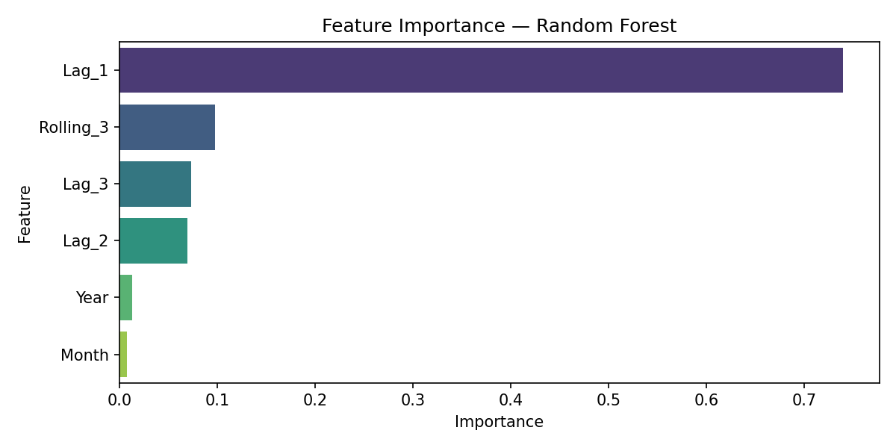

<div align="center">

# ⛽ Pakistan Fuel Price Predictor

> Predict monthly petrol prices using 15 years of historical data.


A machine learning project that builds a full time-series regression pipeline — feature engineering, lag variables, model comparison, and evaluation — on 15 years of Pakistan petrol price data.

</div>

---

## Install
```bash
pip install pandas numpy matplotlib seaborn scikit-learn
```

---

## Dataset

[Petrol Prices in Pakistan 2010–2025](https://www.kaggle.com/datasets/nudratabbas/petrol-prices-in-pakistan-20102025) — 180 monthly records of official government petrol prices in PKR per litre.

Download `petrol_prices_pakistan_2010_2025.csv` and place it in the `data/` folder.

---

## Features Used

| Feature | Description |
|---|---|
| `Year` | Calendar year |
| `Month` | Month number (seasonality) |
| `Lag_1` | Previous month's price |
| `Lag_2` | Price 2 months ago |
| `Lag_3` | Price 3 months ago |
| `Rolling_3` | 3-month rolling average |

---

## Results

| Model | RMSE | R² |
|---|---|---|
| Linear Regression | 18.19 | 0.2779 |
| Ridge | 18.35 | 0.2655 |
| **Lasso** | **18.10** | **0.2852** |
| Random Forest | 117.82 | -29.2786 |

---

## Key Findings

- **Lag_1** dominates — accounts for ~74% of feature importance in Random Forest
- Prices surged dramatically in **2022** due to PKR devaluation and removal of government subsidies
- **Lasso** achieves the best performance — L1 regularization handles the high collinearity between lag features effectively
- Random Forest severely overfits on this small dataset (180 rows) — linear models generalize better

---

## How to Run
```bash
python model.py
```

---

## Visualizations



